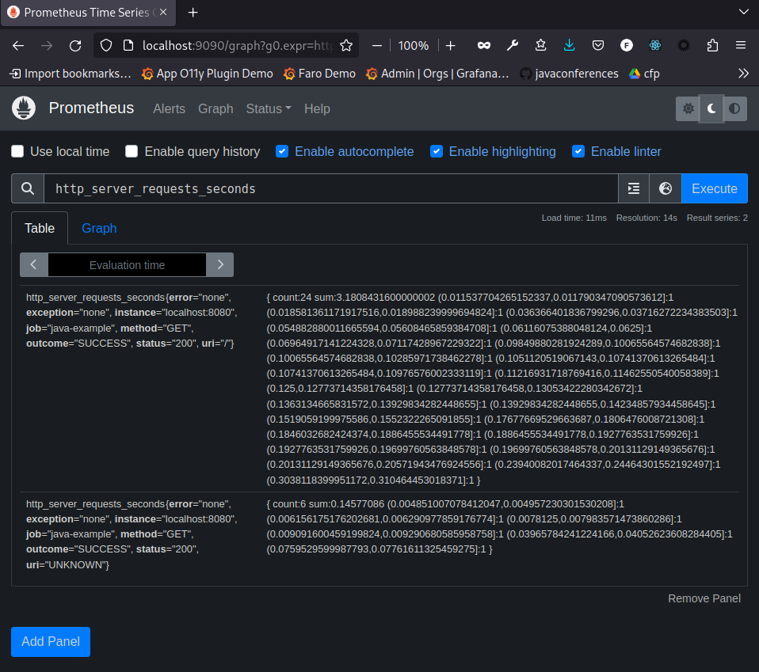
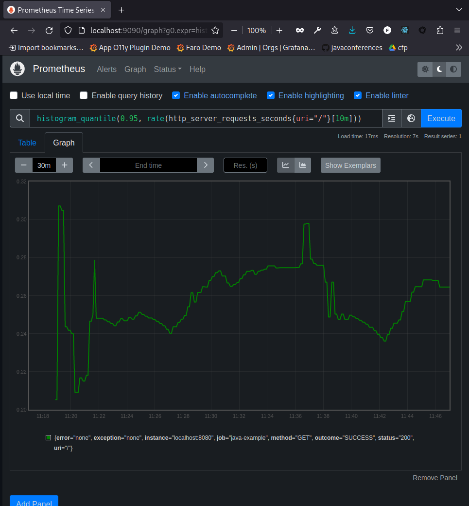

# Micrometer prometheus_native Example

This is an example application for the Micrometer `prometheus_native` registry (TODO: Link to PR).

## Build

As the `prometheus_native` registry has not been merged to Micrometer yet, you need to build Micrometer and Spring Boot from the feature branches to run this application.

1. Build the Micrometer `prometheus-native` feature branch:
   ```shell
   git clone https://github.com/fstab/micrometer.git
   cd micrometer
   git checkout -t origin/prometheus-native
   ./gradlew publishToMavenLocal
   ```
   
2. Build the Spring Boot `micrometer-registry-prometheus_native` feature branch:
   ```shell
   git clone https://github.com/fstab/spring-boot.git
   cd spring-boot
   checkout -t origin/micrometer-registry-prometheus_native
   ./gradlew publishToMavenLocal -x checkstyleMain -x test -x intTest -x documentationTest -x asciidoctor -x asciidoctorPdf -x asciidoctorMultipage -x :spring-boot-project:spring-boot-docs:zip -x :spring-boot-project:spring-boot-docs:publishMavenPublicationToMavenLocal
   ```
   
3. Build the example application:
   ```shell
   git clone https://github.com/fstab/micrometer-registry-prometheus_native-example.git
   cd micrometer-registry-prometheus_native-example
   ./gradlew build
   ```
   
Note that the spring-boot feature branch references the `latest.integration` dependency for Micrometer. So if you have other snapshot versions in your local Maven repository this might fail.

If the build does not work on your machine, use the [Dockerfile](Dockerfile) for reproducing the build:

```
docker build -t micrometer-prometheus_native-example .
```

# Run

Run the example application as usual:

```shell
java -jar ./build/libs/micrometer-registry-prometheus_native-example-0.0.1-SNAPSHOT.jar
```

Or, if you have built the Docker image above:

```shell
docker run --rm -ti -p 8080:8080 micrometer-prometheus_native-example
```

Generate some traffic:

```shell
watch curl -s http://localhost:8080
```

# Test Manually

View the classic text based metrics on [http://localhost:8080/actuator/prometheus](http://localhost:8080/actuator/prometheus). You should see the `http_server_requests_seconds_bucket` metrics representing histogram buckets.

The new native histograms is exposed in Protobuf format. The Prometheus exporter servlet provides a `debug` URL parameter to view the protobuf in human-readable format: [http://localhost:8080/actuator/prometheus?debug=prometheus-protobuf](http://localhost:8080/actuator/prometheus?debug=prometheus-protobuf).

# Test with the Prometheus Server

1. Download from [https://github.com/prometheus/prometheus/releases](https://github.com/prometheus/prometheus/releases).
2. Extract the archive
3. Edit `prometheus.yml` and append the following snippet at the end:
   ```yaml
    job_name: "java-example"
    metrics_path: '/actuator/prometheus'
    static_configs:
      - targets: ["localhost:8080"]
   ```
4. Run with native histograms and examplars enabled:
   ```shell
   ./prometheus --enable-feature=native-histograms --enable-feature=exemplar-storage
   ```

Verify that the `java-example` target is up on [http://localhost:9090/targets](http://localhost:9090/targets).

Prometheus is now scraping metrics in Protobuf format. If you type the name `http_server_requsts` you will see a non-human-readable representation of the histogram including the native buckets:



Use the `histogram_quantile()` function to calculate quantiles from the native histogram:

```
histogram_quantile(0.95, rate(http_server_requests_seconds{uri="/"}[10m]))
```


